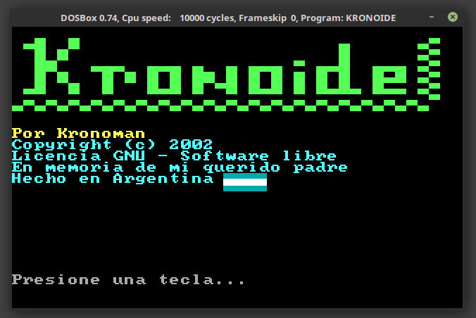
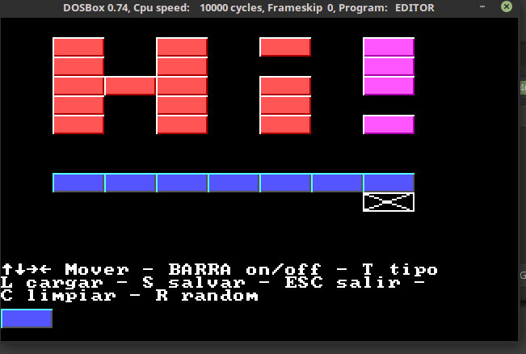

# Kronoide

Un clon de *Arkanoide* / *Breakout* en *Qbasic*

Por Kronoman

Copyright (c) 2002-2020
Software libre

En memoria de mi querido padre

Hecho en Argentina

--------------------------------------------------
## Informacion

Es un juego interesante para aprender a programar, creado 100% por mi desde cero.

Se puede ejecutar con QBASIC y correr en DOS, o DosBox.

Tambien es compilable con el compilador de QBASIC (de ahi salieron los .exe)

Pueden contactarme en

https://ar.linkedin.com/in/alvarogonzalezf

## Compilar / Ejecutar

El juego se puede jugar en DOS, o en Windows.

### MS-DOS / DosBox

Se puede ejecutar en DOS con QBASIC interpretado.

O compilar con QBasic 4.5 en un EXE nativo para DOS.

https://www.qbasic.net/

### Windows

Se puede compilar con QB64 para Windows nativo 64 bits

El release 64 bits, Julio 2020, fue creado con ese compilador

https://www.qb64.org

--------------------------------------------------

## Screenshoots

### Intro

### Editor

### Gameplay

